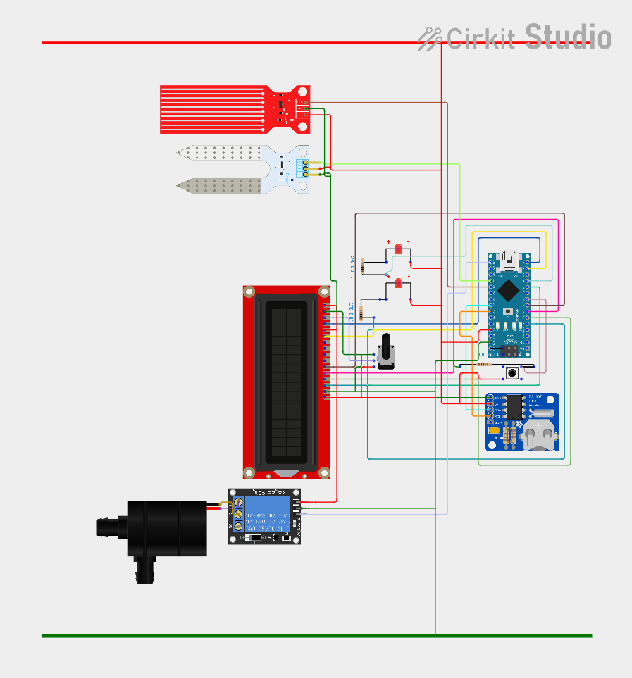
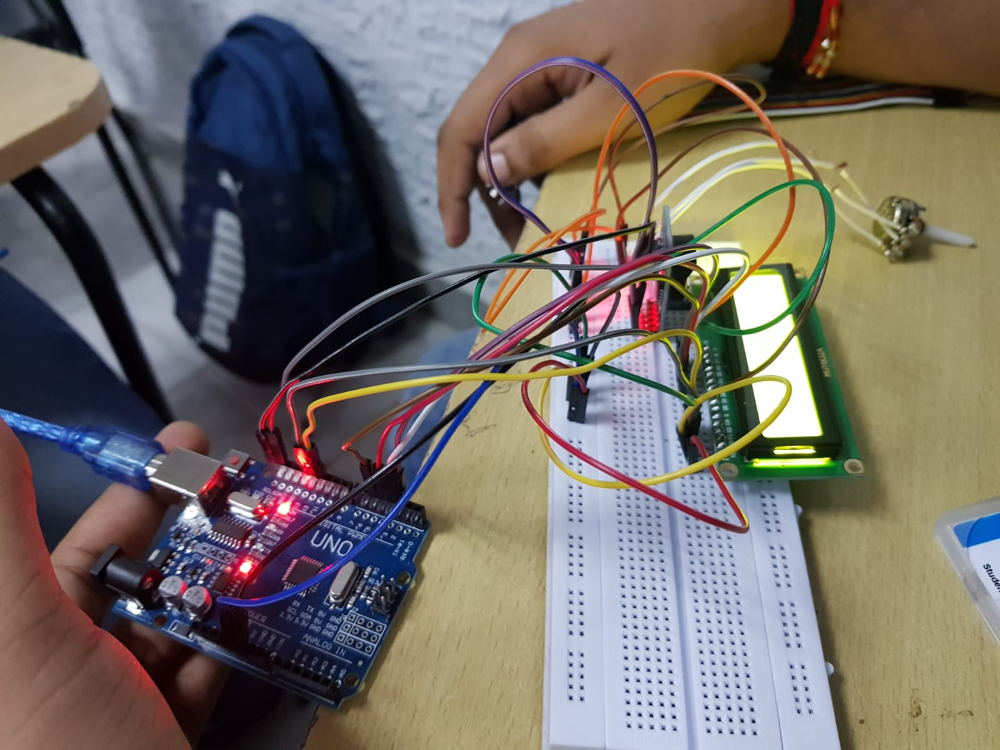

# DRIPPO

### Introduction:
Drippo is a completely automated device running on arduino nano hardware to make your gardening expeirence hassle free.The irrigation process  starts and stops exactly when it is required thus optimize energy requirements and using moisture detection technique it also becomes a water saving device 
It has Two Modes:   
1-Manual   
2-Automatic 

## Hardware used:
1. Arduino Nano
2. RTC 3231(Real Time Clock)
3. LCD Display(16*2)
4. Moisture Sensor
5. Water Level Sensor
6. 5V Relay
7. 2 led ,switch and resistors,10k potentiometer

## Working: 
### Mannual-
   Works like any normal water tap used for irrigation.
### Automatic-
   The device comes with set of hours in which the plant is needed to be irrigated.It can be customized or can be fixed by the programmer like 4  times a day.
   If we choose automatic mode first our controller will fetch the time from RTC and check it with the irrigation time provided.If the time matches the controller will check for the    water level in the tank.If the water level is low it will indicate on the display otherwise if water level is fine it will check for the moisture content of soil.If the soil is      moist i.e plants are already irrigated and doesn't need any further water the pump will be in Off State.Whereas If the soil is Dry it will Turn ON the Pump  and water will start     flowing through the Pipe and once the moisture sensor senses the soil to be moist it will automatacilly turn the Pump Off till the next irrgation time and same process will be       proceed..
 

## FLOW CHART

## CIRCUIT BLUEPRINT 

## HARDWARE DEVICE
  
   
 
          
          

## PRODUCT OPERATION SCREENSHOTS
  
  
  
  
  
  
  
  

